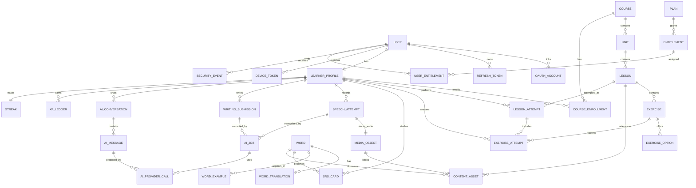
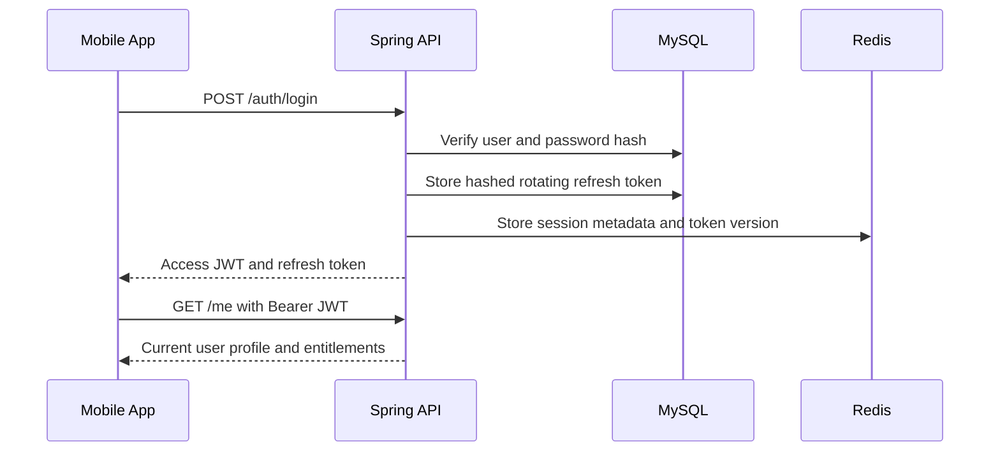
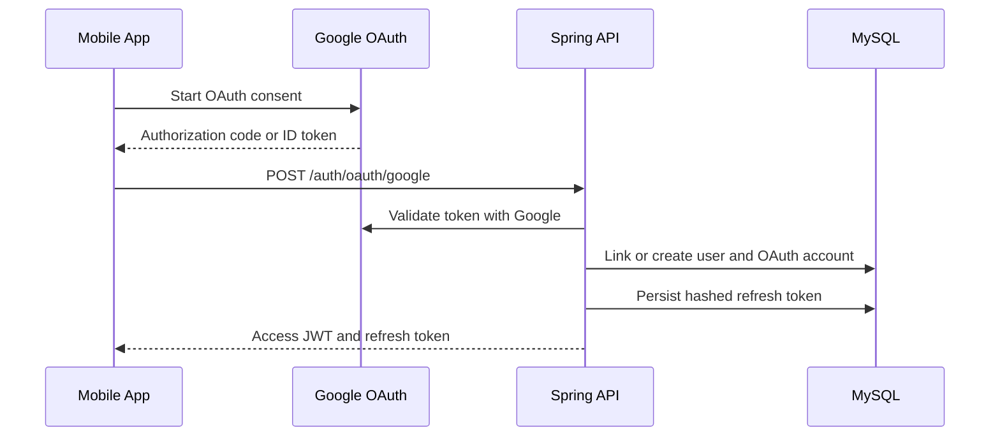
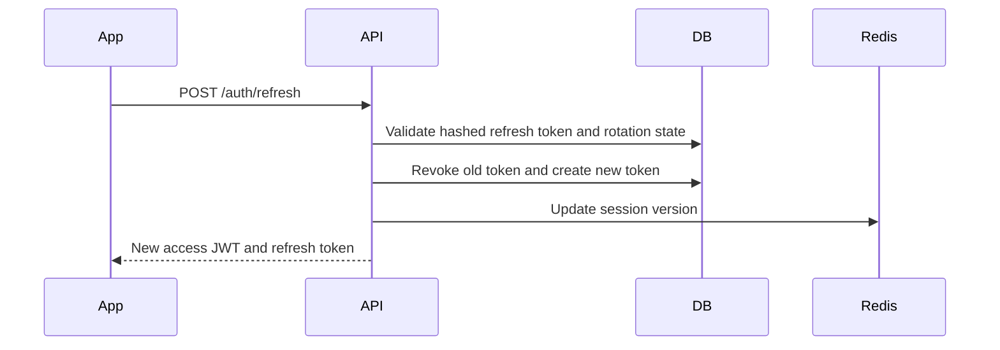
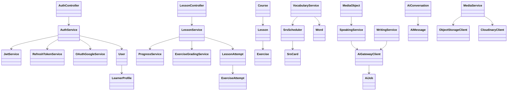
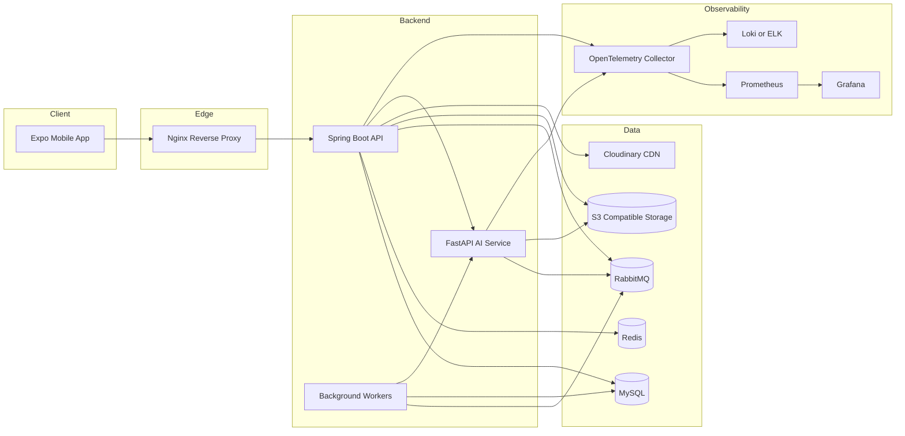
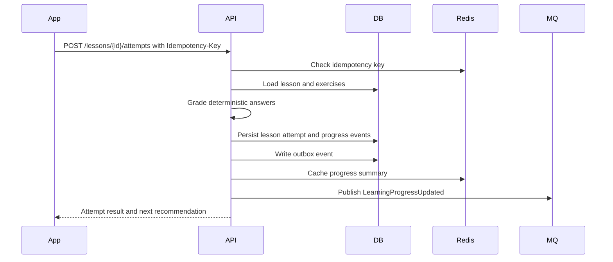
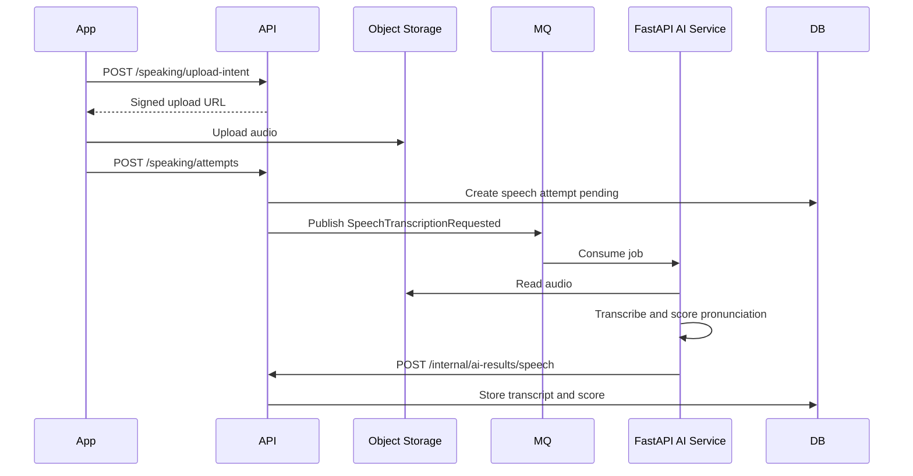
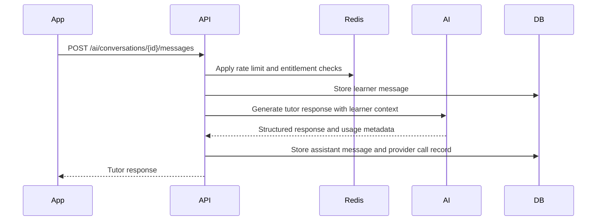

# WortMeister Software Architecture Document

Version: 1.0  
Status: Architecture only, no implementation  
Target: Production-grade AI-powered German language learning platform  
Primary clients: React Native mobile app, administrative web console in future phase  

## 1. Executive Summary

WortMeister is a mobile-first German language learning platform that combines structured curriculum, spaced repetition, speech practice, writing feedback, image-based learning, adaptive quizzes, and AI tutoring. The product is designed as a modular distributed system with a Spring Boot core backend, a Python FastAPI AI service, MySQL as the source of truth, Redis for low-latency state, RabbitMQ for asynchronous processing, object storage for media, and Docker-based deployment behind Nginx.

The architecture avoids a beginner CRUD shape. The system is organized around learning domains, personalization, AI orchestration, content pipelines, observability, security, and operational resilience. Business-critical state remains in the Spring Boot backend. AI capabilities are isolated behind an internal service boundary so providers such as Gemini, OpenAI, Whisper, embedding models, and image understanding models can evolve independently.

## 2. Architecture Goals

- Serve thousands of learners with predictable latency and recoverable failures.
- Keep user learning progress, payment-relevant entitlements, and identity data consistent.
- Isolate AI provider volatility from core product logic.
- Support mobile offline-first learning sessions where possible.
- Enable safe experimentation with lesson recommendation, prompt versions, and AI feedback models.
- Maintain auditability for authentication, moderation, AI usage, and content changes.
- Provide production observability from day one.

## 3. System Context

Primary actors:

- Learner: uses the mobile app for lessons, vocabulary, speaking, writing, tests, and streaks.
- Admin/content editor: manages curriculum, words, grammar units, media, prompts, and moderation.
- AI worker: generates feedback, transcriptions, hints, explanations, embeddings, and image descriptions.
- External identity provider: Google OAuth2.
- External AI providers: Gemini, OpenAI, Whisper-compatible speech, embedding provider, image model.
- Storage provider: Cloudinary and S3-compatible object storage.

High-level components:

- Mobile app: Expo React Native TypeScript application.
- API gateway/reverse proxy: Nginx.
- Core API: Spring Boot 3 Java 21 monolith with modular domain boundaries.
- AI service: FastAPI microservice with provider abstraction.
- MySQL: transactional system of record.
- Redis: cache, rate limits, session metadata, idempotency, ephemeral learning state.
- RabbitMQ: asynchronous jobs and integration events.
- Object storage: audio, images, generated media, exports, logs where applicable.

## 4. Folder Structure

```text
wortmeister/
  docs/
    ARCHITECTURE.md
    adr/
      0001-modular-monolith-first.md
      0002-ai-service-boundary.md
      0003-authentication-model.md
    diagrams/
  apps/
    mobile/
      app.json
      package.json
      src/
        app/
        navigation/
        screens/
        features/
          auth/
          onboarding/
          learn/
          vocabulary/
          speaking/
          writing/
          ai-tutor/
          profile/
          subscriptions/
        shared/
          api/
          components/
          design-system/
          hooks/
          storage/
          validation/
          telemetry/
        state/
        assets/
        types/
        config/
      tests/
        unit/
        integration/
        e2e/
  services/
    api/
      build.gradle
      src/main/java/com/wortmeister/
        WortMeisterApplication.java
        common/
          config/
          security/
          web/
          errors/
          events/
          auditing/
          observability/
        identity/
        learner/
        curriculum/
        learning/
        vocabulary/
        speaking/
        writing/
        ai/
        media/
        notification/
        gamification/
        subscription/
        admin/
      src/main/resources/
        application.yml
        db/migration/
      src/test/
    ai-service/
      pyproject.toml
      app/
        main.py
        api/
        core/
        providers/
          openai/
          gemini/
          whisper/
          embeddings/
          vision/
        services/
        schemas/
        workers/
        prompts/
        observability/
      tests/
  infra/
    docker/
      api.Dockerfile
      ai-service.Dockerfile
      nginx.Dockerfile
    nginx/
      nginx.conf
      conf.d/
    compose/
      docker-compose.local.yml
      docker-compose.prod.yml
    mysql/
      init/
    redis/
    rabbitmq/
    monitoring/
      prometheus.yml
      grafana/
      loki/
  .github/
    workflows/
      mobile-ci.yml
      backend-ci.yml
      ai-service-ci.yml
      docker-release.yml
      deploy.yml
  scripts/
    dev/
    ops/
```

The first production release should use a modular monolith for the Java backend rather than premature microservices. Domain packages must enforce boundaries through package-private internals, service interfaces, events, and architecture tests.

## 5. Database Architecture

Database: MySQL 8.x  
Migration tool: Flyway  
Primary model: normalized relational schema with append-only event/audit tables for critical flows  
Soft deletes: only for content/admin-managed entities where recovery matters  
Hard deletes: allowed for expiring transient AI jobs after retention windows  
PII strategy: minimal storage, encrypted sensitive fields, separated auth identities from learner profile  

Core schema groups:

- identity: users, credentials, OAuth accounts, refresh tokens, roles, login events.
- learner: learner profiles, preferences, levels, placement results.
- curriculum: languages, CEFR levels, courses, units, lessons, grammar topics, content assets.
- vocabulary: words, lemmas, translations, examples, tags, spaced repetition cards.
- learning: enrollments, lesson attempts, exercise attempts, progress snapshots, mastery records.
- speaking: speech attempts, audio assets, transcripts, pronunciation scores.
- writing: writing prompts, submissions, corrections, rubric scores.
- AI: conversations, messages, AI jobs, provider calls, prompt versions, safety decisions.
- media: upload records, storage objects, transformations.
- gamification: streaks, XP ledger, badges, daily goals.
- notification: device tokens, notification preferences, notification deliveries.
- subscription: plans, entitlements, invoices, payment provider refs.
- audit: admin actions, security events, data exports.

Key database principles:

- Use UUID/ULID public identifiers and numeric internal primary keys where useful for indexing.
- Use optimistic locking on mutable learning state.
- Store derived progress snapshots separately from immutable attempt events.
- Avoid storing raw AI prompts containing unnecessary PII.
- Use outbox tables for reliable RabbitMQ publishing from transactional changes.
- Use composite indexes for learner_id plus recency filters on progress and attempts.

## 6. Entity Relationship Diagram



## 7. Backend Modules

The Spring Boot backend is a modular monolith. Each module owns its aggregate rules, repositories, DTO mapping, service orchestration, and REST endpoints. Shared code must remain generic and small.

Backend modules:

- common: configuration, base entities, domain events, web utilities, validation, exception mapping.
- identity: registration, login, refresh tokens, Google OAuth2, roles, permissions, sessions.
- learner: learner profile, preferences, placement level, daily goals.
- curriculum: courses, units, lessons, exercises, content lifecycle.
- learning: attempts, grading, progress, mastery calculation, next-lesson recommendation.
- vocabulary: word bank, SRS scheduling, card review, vocabulary search.
- speaking: audio upload intent, speech attempts, pronunciation scoring orchestration.
- writing: writing submissions, correction requests, rubric scoring.
- ai: internal client for FastAPI service, AI job tracking, prompt version references, safety policy.
- media: Cloudinary/S3 upload signatures, media metadata, ownership checks.
- gamification: XP ledger, streaks, achievements, badges.
- notification: push tokens, notification jobs, preference checks.
- subscription: plans, entitlements, paywall decisions, provider hooks.
- admin: content management endpoints, audit trails, moderation tools.

Layering per module:

```text
module/
  api/          REST controllers, request/response DTOs
  application/  use cases, transactions, orchestration
  domain/       aggregates, policies, domain events
  persistence/  JPA entities, repositories, projections
  integration/  external clients, message publishers/listeners
```

Architectural rules:

- Controllers never call repositories directly.
- Application services define transactional boundaries.
- Domain policies remain framework-light.
- Cross-module communication uses application interfaces or events.
- External calls are wrapped in typed clients with timeout, retry, circuit breaker, and metrics.

## 8. Mobile Architecture

The Expo app is feature-oriented with shared infrastructure for API, state, storage, telemetry, and design primitives.

Mobile responsibilities:

- Authentication and token refresh.
- Guided onboarding and placement.
- Lesson player with offline-capable lesson bundles.
- Speaking practice with audio recording and upload.
- Writing practice with form validation and AI feedback.
- AI tutor chat with streaming-ready UI architecture.
- Vocabulary SRS queue and daily review.
- Progress dashboard, streaks, achievements, settings.

State model:

- React Query: server state, cache invalidation, pagination, retry, background refresh.
- Zustand: local UI/session state, lesson player state, onboarding state.
- MMKV: secure-ish low-latency local persistence for tokens, feature flags, lightweight progress drafts.
- React Hook Form: forms, validation, error presentation.
- Axios: authenticated API client with refresh interceptor and request correlation IDs.

Recommended feature structure:

```text
features/learn/
  api/
  components/
  hooks/
  screens/
  state/
  types/
  utils/
```

Offline strategy:

- Cache current course outline, next lessons, vocabulary queue, and media manifests.
- Persist in-progress lesson answers locally until successfully submitted.
- Use idempotency keys for attempt submission.
- Keep AI tutor, speech scoring, and image understanding online-only for first release.
- Display clear sync states: pending, syncing, synced, failed.

Navigation:

- Root navigator: auth stack, onboarding stack, main app tabs.
- Main tabs: Learn, Practice, Tutor, Progress, Profile.
- Deep links: lesson, review session, notification target, OAuth callback.

## 9. Authentication Flow

Authentication modes:

- Email/password with JWT access token and rotating refresh token.
- Google OAuth2 login through backend-controlled token exchange.
- Optional future passkeys.

Token model:

- Access token: short-lived JWT, 10 to 15 minutes.
- Refresh token: opaque, rotating, stored hashed in database.
- Mobile storage: access token in memory where possible, refresh token in MMKV with platform security hardening.
- Token claims: subject, user public id, roles, entitlement tier, token version, issued at, expiry.

Email/password flow:



Google OAuth2 flow:



Refresh flow:



## 10. API Structure

Base path: `/api/v1`  
Admin path: `/api/admin/v1`  
Internal path: `/internal/v1` restricted by network and service credentials  
Documentation: OpenAPI via Swagger UI in non-production or protected production route  

API categories:

```text
POST   /auth/register
POST   /auth/login
POST   /auth/oauth/google
POST   /auth/refresh
POST   /auth/logout
GET    /me
PATCH  /me/profile

GET    /courses
GET    /courses/{courseId}
POST   /courses/{courseId}/enroll
GET    /lessons/{lessonId}
POST   /lessons/{lessonId}/attempts
POST   /exercise-attempts

GET    /vocabulary/reviews/due
POST   /vocabulary/reviews
GET    /vocabulary/search

POST   /speaking/upload-intent
POST   /speaking/attempts
GET    /speaking/attempts/{attemptId}

POST   /writing/submissions
GET    /writing/submissions/{submissionId}

POST   /ai/conversations
POST   /ai/conversations/{conversationId}/messages
GET    /ai/conversations/{conversationId}

POST   /media/upload-intent
POST   /media/complete

GET    /progress/summary
GET    /progress/calendar
GET    /gamification/streak

GET    /subscriptions/plans
GET    /subscriptions/me/entitlements
```

API standards:

- JSON request and response bodies.
- RFC 7807-style problem responses.
- Idempotency-Key header for attempt submission, payments, uploads, and AI job creation.
- X-Correlation-Id accepted from client and propagated to logs and downstream services.
- Cursor pagination for timelines and attempt history.
- ETags for mostly static curriculum resources.
- Versioned APIs; breaking changes require `/v2`.

## 11. AI Service Architecture

The FastAPI service owns AI orchestration, provider adapters, prompt rendering, safety filters, embeddings, speech transcription, and image understanding. It does not own learner progress or authentication decisions.

AI service modules:

- api: internal endpoints called by Spring API and workers.
- providers: OpenAI, Gemini, Whisper, embeddings, vision.
- services: tutor, writing correction, speech transcription, pronunciation, image vocabulary.
- prompts: versioned prompt templates with metadata.
- workers: RabbitMQ consumers for async jobs.
- schemas: Pydantic request/response contracts.
- observability: token usage, latency, model errors, prompt versions.

Provider abstraction:

```text
AiProviderClient
  generate_text(request)
  generate_structured(request, schema)
  transcribe_audio(request)
  embed_texts(request)
  analyze_image(request)
```

AI data policy:

- Store prompt version, model, token count, latency, and structured result.
- Avoid storing unnecessary raw audio transcripts beyond product need.
- Redact PII before sending text to external providers where feasible.
- Mark AI output as advisory and verify through deterministic grading where possible.

## 12. Class Diagram



## 13. Deployment Architecture



Deployment stages:

- Local: Docker Compose for MySQL, Redis, RabbitMQ, API, AI service, Nginx.
- Staging: production-like environment with isolated credentials and sample data.
- Production: containerized services behind Nginx, managed database preferred, backups enabled.

Nginx responsibilities:

- TLS termination if not handled by cloud load balancer.
- Route `/api` to Spring Boot.
- Route `/ai-internal` only inside private network if exposed at all.
- Request body limits for media endpoints.
- Basic WAF-style header restrictions.
- Compression for JSON where appropriate.

## 14. Sequence Diagrams

Lesson attempt submission:



Speaking practice:



AI tutor message:



## 15. Security Architecture

Security controls:

- Spring Security as the central enforcement point.
- JWT access tokens signed with asymmetric keys.
- Refresh token rotation with reuse detection.
- Password hashing with Argon2id or BCrypt with strong parameters.
- Google OAuth token validation server-side.
- Role-based and permission-based access for admin endpoints.
- Object ownership checks for every media access.
- Signed upload URLs with short expiration.
- CSRF disabled for token-based mobile API, enabled for future cookie web admin if needed.
- Strict CORS allowlist.
- Rate limits by user, IP, endpoint, and AI cost category.
- Secrets injected through environment or secret manager, never committed.
- Input validation using Bean Validation and explicit DTOs.
- Output encoding handled by clients, no HTML rendering in API.
- Security audit logs for login, refresh reuse, permission denial, admin edits, export actions.
- Dependency scanning and container scanning in CI.

Data protection:

- Encrypt sensitive columns where necessary.
- Keep OAuth subject IDs separate from public user IDs.
- Avoid logging tokens, passwords, provider keys, raw prompts with PII, and signed URLs.
- Apply retention windows to audio, AI provider payloads, and debug traces.
- Support account deletion workflow with anonymized learning analytics where legally acceptable.

Internal service security:

- AI service only reachable from the backend network.
- Internal endpoints require service token or mTLS in higher maturity stage.
- RabbitMQ users separated by producer/consumer permissions.
- Database user privileges scoped per service where possible.

## 16. Logging Strategy

Use structured JSON logs across backend and AI service.

Common log fields:

- timestamp
- level
- service
- environment
- correlation_id
- request_id
- user_id_hash
- endpoint
- method
- status_code
- latency_ms
- error_code
- ai_provider
- model
- token_count

Rules:

- INFO for request summaries, auth events, business milestones.
- WARN for retryable downstream issues, rate limit denials, suspicious behavior.
- ERROR for failed operations requiring investigation.
- DEBUG only in local/staging, never with secrets.
- Propagate X-Correlation-Id from mobile to API, AI service, and workers.
- Sample high-volume successful events but never sample security events.

Recommended stack:

- Spring Boot Micrometer + Logback JSON encoder.
- FastAPI structlog or standard logging with JSON formatter.
- OpenTelemetry for traces.
- Loki or ELK for logs.
- Grafana for dashboards.

## 17. Exception Handling Strategy

API errors use a stable problem format:

```json
{
  "type": "https://api.wortmeister.com/problems/validation-error",
  "title": "Validation failed",
  "status": 400,
  "code": "VALIDATION_ERROR",
  "message": "One or more fields are invalid.",
  "correlationId": "01J...",
  "details": []
}
```

Exception categories:

- ValidationException -> 400
- AuthenticationException -> 401
- AuthorizationException -> 403
- ResourceNotFoundException -> 404
- ConflictException -> 409
- RateLimitExceededException -> 429
- AiProviderUnavailableException -> 503
- StorageException -> 502 or 503
- UnexpectedException -> 500

Backend approach:

- Central `@ControllerAdvice` for REST mapping.
- Domain exceptions with stable business error codes.
- No stack traces in client responses.
- Retryable downstream exceptions annotated and counted.
- Idempotent operations return previous result for duplicate keys.

Mobile approach:

- Normalize errors in Axios layer.
- Use React Query retry only for safe retryable calls.
- Show field errors from `details`.
- Show sync recovery actions for offline attempt failures.

AI service approach:

- Pydantic validation errors mapped to stable internal error payloads.
- Provider-specific errors converted to common error types.
- Timeouts and quota errors classified separately.

## 18. Caching Strategy

Redis use cases:

- Access token/session metadata and token version.
- Refresh token reuse flags.
- Rate limit counters.
- Idempotency records.
- Frequently requested curriculum summaries.
- Learner progress summary cache.
- SRS due-count cache.
- AI tutor short context cache for active sessions.
- Feature flags if no external flag provider is used.

Client cache:

- React Query for server state.
- Persist selected query data for course outlines and current lesson.
- MMKV for local drafts, tokens, sync queue, lightweight flags.

Cache invalidation:

- Curriculum cache invalidates on admin content publish.
- Progress cache invalidates on lesson attempt and review submission.
- Entitlement cache invalidates on subscription webhook.
- AI context cache expires by short TTL and conversation updates.

TTL guidance:

- Curriculum published content: 5 to 30 minutes, ETag-backed.
- Progress summary: 1 to 5 minutes or event invalidated.
- Rate limits: endpoint-specific rolling windows.
- Idempotency: 24 hours for attempts, longer for payments.
- AI context: 10 to 30 minutes.

## 19. Rate Limiting Strategy

Use Redis-backed distributed rate limiting.

Dimensions:

- Anonymous IP.
- Authenticated user.
- Device ID.
- Endpoint category.
- AI cost category.
- Subscription tier.

Suggested policies:

- Auth login: strict IP and account-based limits.
- Refresh token: moderate per session and user.
- Lesson submissions: generous but protected by idempotency.
- AI tutor: tier-based daily quota and burst limit.
- Speech transcription: tier-based minutes per day.
- Image understanding: low burst limit due to cost.
- Admin endpoints: low but practical limits, audited.

Response:

- HTTP 429.
- Include Retry-After where possible.
- Include safe user-facing error code.
- Never reveal whether an email/account exists through rate-limit messages.

## 20. Monitoring Strategy

Golden signals:

- Latency: p50, p95, p99 by endpoint and service.
- Traffic: requests per minute, active users, queue depth.
- Errors: HTTP 5xx, business error rates, provider failures.
- Saturation: CPU, memory, DB connections, Redis memory, RabbitMQ queue depth.

Product metrics:

- Daily active learners.
- Lesson completion rate.
- Review completion rate.
- Speech attempt success rate.
- Writing feedback latency.
- AI tutor messages per learner.
- Streak retention.
- Placement completion.

AI metrics:

- Provider latency by model.
- Token usage and cost by feature.
- Timeout rate.
- Safety rejection rate.
- Structured output parse failure rate.
- Fallback provider usage.

Alerts:

- API p95 latency above threshold for 10 minutes.
- Error rate above threshold.
- RabbitMQ queue age above threshold.
- AI provider quota near exhaustion.
- MySQL replication/backup failure.
- Redis memory pressure.
- Login failure spikes.
- Refresh token reuse detection.

## 21. CI/CD Pipeline

GitHub Actions workflows:

Backend CI:

- Checkout.
- Set up Java 21.
- Run formatting/lint checks.
- Run unit tests.
- Run integration tests with Testcontainers for MySQL, Redis, RabbitMQ.
- Generate OpenAPI spec.
- Build Docker image.
- Scan dependencies and container image.

AI service CI:

- Set up Python.
- Install dependencies.
- Run Ruff/Black/Mypy or equivalent.
- Run unit tests.
- Run contract tests against mocked provider adapters.
- Build Docker image.
- Scan dependencies and image.

Mobile CI:

- Set up Node.
- Install dependencies.
- Typecheck.
- Lint.
- Run unit tests.
- Run component tests where applicable.
- Run Expo/EAS build checks for selected branches.

Release workflow:

- Trigger on tag or main branch merge.
- Build versioned images.
- Push images to registry.
- Publish mobile build through EAS channels.
- Apply Flyway migrations during deploy phase with rollback plan.
- Deploy staging first.
- Run smoke tests.
- Manual approval for production.
- Deploy production.
- Run post-deploy health checks.

Deployment safety:

- Blue/green or rolling deployment for API and AI service.
- Backward-compatible migrations only in normal releases.
- Feature flags for risky user-facing changes.
- Automatic rollback on failed health checks where platform supports it.

## 22. OpenAPI and Contract Strategy

- Spring API publishes OpenAPI JSON from annotated controllers.
- Mobile API client types generated from OpenAPI or maintained with contract tests.
- Internal AI service contracts documented separately and tested using schema fixtures.
- Breaking API changes require versioning, deprecation notice, and mobile compatibility window.
- Error codes are part of the contract.

## 23. Messaging and Async Jobs

RabbitMQ exchanges:

- `learning.events`
- `ai.jobs`
- `notification.jobs`
- `media.jobs`
- `audit.events`

Important events:

- `UserRegistered`
- `CourseEnrolled`
- `LessonAttemptCompleted`
- `VocabularyReviewCompleted`
- `SpeechTranscriptionRequested`
- `WritingFeedbackRequested`
- `AiJobCompleted`
- `EntitlementChanged`
- `StreakUpdated`

Reliability:

- Transactional outbox in MySQL for Spring-published events.
- Dead-letter queues for failed jobs.
- Exponential backoff retries.
- Poison message quarantine after max attempts.
- Idempotent consumers using event IDs.

## 24. Storage Architecture

Cloudinary:

- Optimized image delivery.
- Transformations for thumbnails and content assets.
- CDN-backed lesson images.

S3-compatible storage:

- Raw audio recordings.
- User-uploaded images before moderation.
- Export files.
- Internal artifacts.

Media lifecycle:

- Client requests upload intent.
- Backend validates ownership and feature entitlement.
- Backend issues signed upload URL or Cloudinary signature.
- Client uploads directly.
- Client reports completion.
- Backend stores media metadata.
- Background job validates file size, type, scan status, and duration.

## 25. Security Threat Model Summary

Primary threats:

- Token theft from mobile device.
- Refresh token replay.
- Credential stuffing.
- Prompt injection into AI tutor.
- Excessive AI usage causing cost abuse.
- Unauthorized media access.
- Admin content tampering.
- PII leakage in logs or AI prompts.
- Dependency and container vulnerabilities.

Mitigations:

- Rotating refresh tokens and session invalidation.
- Device-aware session metadata.
- Rate limiting and anomaly alerts.
- AI prompt boundary design and output filtering.
- Entitlement-aware AI quotas.
- Signed URLs with short TTL and ownership checks.
- Admin RBAC and audit logs.
- Redaction filters.
- CI security scanning.

## 26. Environment Configuration

Configuration groups:

- Database URL, username, password.
- Redis URL.
- RabbitMQ URL and credentials.
- JWT signing key references.
- Google OAuth client IDs.
- AI provider API keys.
- S3 endpoint, bucket, access key, secret key.
- Cloudinary cloud name, key, secret.
- CORS origins.
- Rate limit policies.
- Log level and telemetry exporters.

Rules:

- Separate `.env.local`, staging secrets, and production secrets.
- No secrets in Git.
- Use strong secret rotation process.
- Prefer managed secret storage for production.

## 27. Non-Functional Requirements

Availability:

- API target: 99.9 percent after launch maturity.
- AI features degrade gracefully when providers fail.

Performance:

- Auth and profile endpoints p95 under 300 ms excluding network.
- Lesson read endpoints p95 under 400 ms.
- Attempt submission p95 under 700 ms for deterministic grading.
- AI tutor first response target under 5 seconds for non-streaming MVP.

Scalability:

- Stateless API containers.
- Horizontal scaling for API and AI service.
- Queue-based scaling for speech/writing jobs.
- Read replicas can be introduced for analytics-heavy read paths.

Reliability:

- Idempotency for user-submitted attempts and paid operations.
- Outbox pattern for transactional events.
- Retries only where safe.
- Dead-letter queues for manual investigation.

Maintainability:

- Module boundary tests.
- API contract tests.
- Prompt versioning.
- ADRs for major decisions.

## 28. Initial Build Phases

Phase 1: Platform foundation

- Backend modular skeleton.
- Auth, user profile, course read model.
- Mobile auth and navigation shell.
- Docker Compose.
- Observability baseline.

Phase 2: Learning core

- Curriculum, lessons, exercises.
- Attempt submission.
- Progress tracking.
- Vocabulary SRS.

Phase 3: AI features

- AI service boundary.
- Writing feedback.
- Speech transcription and pronunciation scoring.
- AI tutor.

Phase 4: Production hardening

- Rate limits.
- Entitlements.
- Admin audit.
- Monitoring and alerts.
- CI/CD release flow.

Phase 5: Growth

- Personalization models.
- Image understanding.
- Rich analytics.
- A/B testing.
- Expanded content tooling.

## 29. Key Architectural Decisions

- Start with a modular monolith for the Java backend to maximize delivery speed while preserving future extraction paths.
- Keep AI orchestration in a separate FastAPI service because AI dependencies, runtime behavior, and provider integrations evolve differently from core product logic.
- Use MySQL as the transactional source of truth and Redis only for ephemeral acceleration.
- Use RabbitMQ for long-running or unreliable workflows such as speech, writing feedback, media validation, and notifications.
- Treat mobile offline support as a first-class concern for lessons and vocabulary, but keep high-cost AI features online for the first release.
- Version prompts, APIs, and database migrations from the beginning.

## 30. Acceptance Checklist for Future Implementation

- No module bypasses its application service layer.
- Every external call has timeout and metrics.
- Every user mutation has authorization checks.
- Critical mutations have idempotency where repeat submissions are possible.
- Every API error has stable code and correlation ID.
- Flyway migrations are backward compatible.
- AI provider calls are metered and associated with feature and user.
- Logs are structured and redact sensitive values.
- CI blocks on tests, type checks, dependency scans, and container scans.
- Deployment has health checks and rollback procedure.

