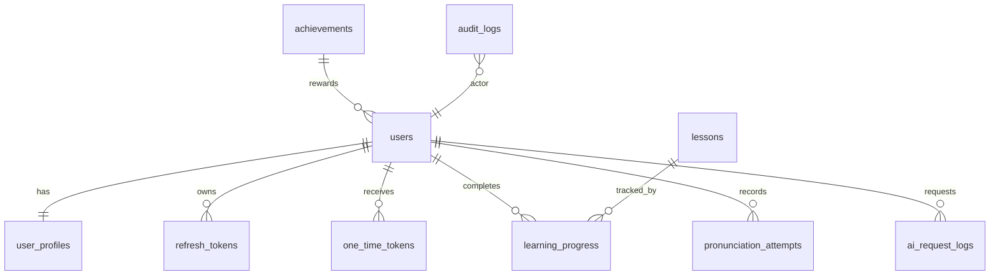

# Database Documentation

Database: MySQL 8.x  
Migration tool: Flyway  
Primary schema owner: Spring Boot API

## Schema Groups

- Identity: `users`, `user_profiles`, `refresh_tokens`, `one_time_tokens`
- Learning: `lessons`, `vocabulary_items`, `grammar_topics`, `media_assets`, `learning_progress`, `pronunciation_attempts`
- Gamification: `achievements`
- AI: `ai_request_logs`
- Audit: `audit_logs`

## ER Diagram

## Migration Rules

- Every schema change must be a Flyway migration.
- Migrations must be backward compatible for normal releases.
- Destructive changes require a backup, migration window, and rollback plan.
- Public IDs are exposed externally; numeric IDs remain internal.

## SQL Injection Protection

The backend uses Spring Data JPA repositories and parameter binding. Raw SQL should be avoided unless reviewed and covered by tests.
