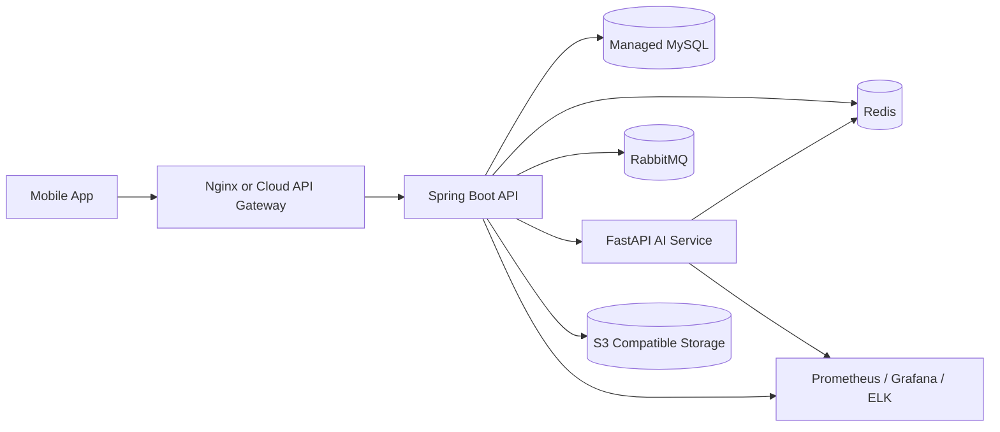

# Deployment Guide

## Local Deployment

```bash
docker compose -f infra/compose/docker-compose.local.yml up --build
```

Services:

- MySQL: `3306`
- Redis: `6379`
- RabbitMQ: `5672`, management `15672`
- AI service: `8000`
- Prometheus: `9090`
- Grafana: `3001`
- Elasticsearch: `9200`
- Kibana: `5601`

## Production Deployment

Recommended production topology:



## Release Steps

1. Run CI for backend, AI service, and mobile.
2. Build versioned Docker images.
3. Push images to registry.
4. Apply Flyway migrations.
5. Deploy staging.
6. Run smoke tests and k6 baseline.
7. Promote to production after approval.
8. Monitor dashboards and logs.

## Environment Management

Use separate environment values for local, staging, and production. Production secrets must live in GitHub Actions secrets or a cloud secret manager.
