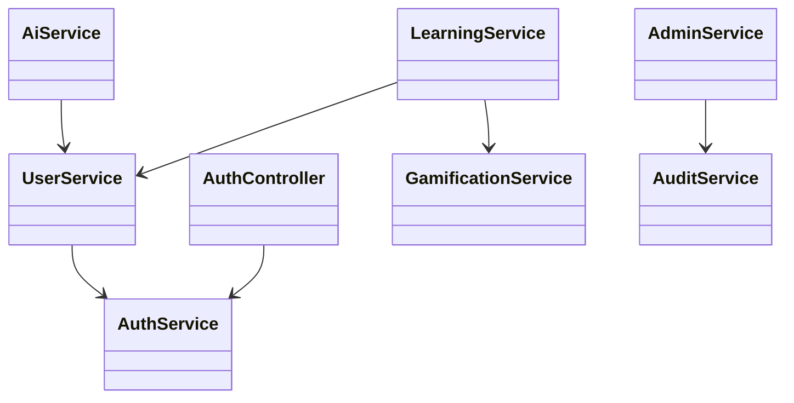
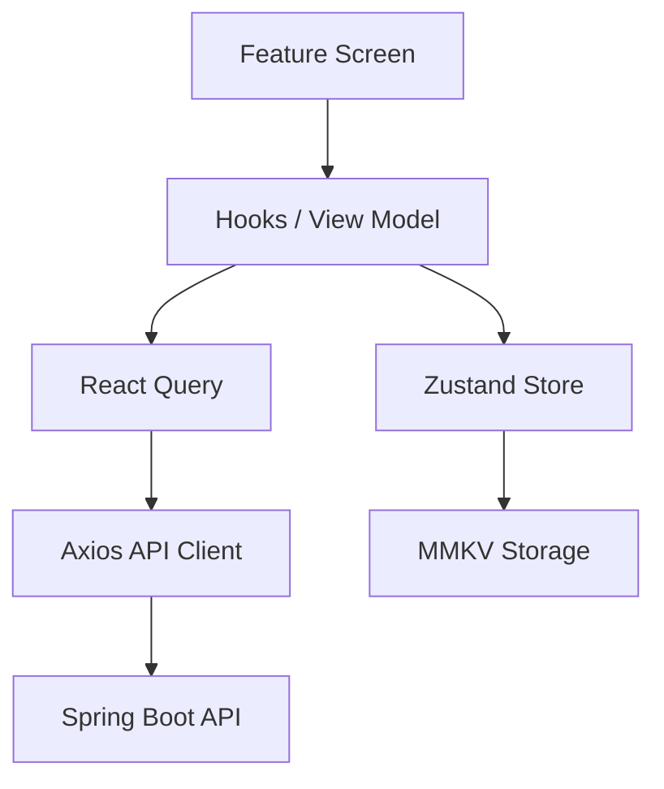

# UML Diagrams

## Backend Module Diagram

```mermaid
classDiagram
  class AuthController
  class AuthService
  class UserService
  class LearningService
  class GamificationService
  class AiService
  class AdminService
  class AuditService

  AuthController --> AuthService
  UserService --> AuthService
  LearningService --> UserService
  LearningService --> GamificationService
  AiService --> UserService
  AdminService --> AuditService
```

## Mobile MVVM Diagram

```mermaid
flowchart TD
  Screen[Feature Screen] --> ViewModel[Hooks / View Model]
  ViewModel --> ReactQuery[React Query]
  ViewModel --> Zustand[Zustand Store]
  ReactQuery --> Axios[Axios API Client]
  Axios --> Backend[Spring Boot API]
  Zustand --> MMKV[MMKV Storage]
```
